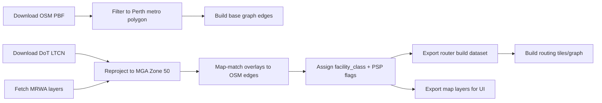

# Perth PSP‑priority cycling web app MVP

## Executive summary

A Perth‑first cycle router that *maximises Principal Shared Path (PSP) use* is feasible as an MVP, but it will only be as good as its *PSP identification layer* (a local classification that distinguishes PSPs from generic shared paths, painted lanes, and on‑road links). PSPs are explicitly described by the WA Government as high‑quality shared paths forming the “backbone” of the WA bike network, typically ~4 m wide, lit, and grade‑separated at intersections where possible. citeturn12search10turn12search11

The practical path to an MVP is:

1) Build a Perth cycling graph from OpenStreetMap (OSM) data (daily‑updated extracts); 2) add *WA authoritative overlays* (DoT Long‑Term Cycle Network hierarchy + MRWA road/path asset layers + MRWA crash, speed and closure feeds) to compute a “PSP‑likelihood / PSP‑priority” score per edge; 3) run a routing engine configured with a cost function that heavily favours PSP edges while still guaranteeing connectivity to/from any origin/destination; 4) ship a responsive web app that exports GPX/GeoJSON and can be used with Avenza via GPX import. citeturn14search2turn31view0turn6view0turn19view0turn20view0turn15search7

A key constraint: many SLIP public map services are provided under Landgate’s “SLIP Transaction Personal Use Licence” (personal, non‑commercial use unless otherwise agreed), so you should not assume you can legally use SLIP public basemap/imagery tiles in a public or commercial app without the appropriate licence. citeturn28search0turn28search12turn28search4

## Problem definition and success criteria

**Goal.** A Perth‑first router that returns the “safest” cycling route by strongly prioritising PSP segments, then high‑quality off‑road / protected infrastructure, and only using on‑road riding when necessary to reach or connect PSPs.

**Why a local build is justified.** WA’s cycling governance and delivery is split across state and local government responsibilities, and official audits have highlighted network gaps and fragmentation across the Perth area. citeturn10search20turn0search20 That fragmentation is precisely what generic global routing profiles tend to handle poorly without local weighting and gap‑handling logic.

**Definition of a PSP (for your classifier).** WA Government material defines PSPs as high‑quality shared paths built to Main Roads WA PSP standard, generally 4 m wide, with adequate lighting and grade separation at intersections (where possible), and describes PSPs as the “backbone” of the WA bike network. citeturn12search10turn2search1 Main Roads’ supplement to Austroads explicitly maps DoT’s cycle route hierarchy such that a “Primary Route” built form is a PSP. citeturn12search11

**Success criteria (MVP).**  
A route is considered “PSP‑priority successful” if:

- PSP share (distance) is maximised subject to a reasonable detour cap (e.g., ≤ 20% longer than the shortest legal bicycle route).  
- The router behaves predictably at PSP gaps by switching to the *least‑stress connectors* and re‑joining PSP quickly.  
- Output is exportable (GPX for Avenza import; GeoJSON for GIS/debug). citeturn15search7  
- Results are explainable: show % PSP, number of road crossings, on‑road kilometres, and “why this route”.  
- Latency target: p95 < 700 ms for Perth metro requests on a single mid‑range VM (proposed target; tune after profiling).

image_group{"layout":"carousel","aspect_ratio":"16:9","query":["Mitchell Freeway PSP Perth shared path","Kwinana Freeway PSP Perth principal shared path","Fremantle railway principal shared path Perth","Tonkin Highway PSP Perth shared path"] ,"num_per_query":1}

## Data sources, basemaps, licensing, and access table

### Core principle

Use **OSM for the routable geometry**, then **WA authoritative datasets to label/weight** the geometry (PSP‑priority, safety, closures). This avoids trying to “stitch PDFs” and instead produces a machine‑routable network.

### Data sources table

| Data source | What you use it for | How to access (formats) | Licensing / constraints |
|---|---|---|---|
| entity["organization","Department of Transport","western australia"] Long‑Term Cycle Network (LTCN) DOT‑035 | WA cycle network hierarchy overlays (Primary/Secondary/Local route corridors) + LGA attribution | Data WA downloads (Shapefile + FGDB) and WMS/ArcGIS map service. citeturn31view0turn2search22turn3view0 | CC BY 4.0 via Data WA. citeturn31view0 |
| (Same) PSP Expansion Program map (PDF) | Reference list of PSP corridors/projects and status classes (complete/delivery/planning/future); manual validation layer | Download PDF from DoT page. citeturn16view0turn12search10 | Informational; not a routable dataset by itself. Use as QA/validation unless you digitise. citeturn16view0 |
| entity["organization","Main Roads Western Australia","road agency wa"] Road Network (includes “paths”) | Authoritative WA road + path centrelines; supports identifying MRWA‑controlled path segments and road context | Data WA “Road Network” dataset (WMS/WFS/ArcGIS + GeoJSON/KML/SHP/CSV). citeturn30view0turn6view0 | CC BY 4.0 (with MRWA disclaimer). citeturn30view0 |
| (Same) Road Assets “Road Network” layer (ArcGIS MapServer/17) | Field‑rich network features incl. `NETWORK_TYPE` = “Main Roads Controlled Path” + node linkage fields | ArcGIS REST layer metadata and query endpoint. citeturn6view0turn5view0 | Use under MRWA open data terms; treat as authoritative context, but still validate against OSM geometry. citeturn12search0turn30view0 |
| (Same) Road Assets “Intersections” layer (MapServer/6) | Contains `NODE_TYPE`, including “Principal Shared Path Node” for network‑based PSP inference | ArcGIS REST layer metadata. citeturn9view0 | Best used to *infer* PSP connectivity in MRWA’s network model (see PSP identification section). citeturn9view0 |
| (Same) Crash Information (Last 5 Years) | Safety scoring: bike‑involved crashes, severity, time, location | Data WA dataset + ArcGIS MapServer layer includes `TOTAL_BIKE_INVOLVED`, `SEVERITY`, etc. citeturn17view0turn19view0 | CC BY 4.0; note MRWA statement that records can change and, at least at one point, 2024 records were removed. citeturn17view0turn19view0 |
| (Same) Legal Speed Zones + Road Hierarchy | Road stress proxy (speed environment + arterial hierarchy) where on‑road connectors are unavoidable | RoadAssets MapServer layers 9 and 16 with `SPEED_ZONE_SIGN_VALUE` and `ROAD_HIERARCHY`. citeturn20view0turn21view0 | Open MRWA layers; use as risk covariates not as a substitute for cyclist infrastructure. citeturn20view0turn21view0 |
| (Same) WebEOC Roadworks / closures feeds | Dynamic avoidance/warnings for closures/disruptions affecting paths/roads | MRWA TravelInformation MapServer + Data WA WebEOC datasets. citeturn25view0turn26view0turn24search1 | Open datasets designed for Travel Map usage; still treat as “advisory” and cache carefully. citeturn24search1turn12search5 |
| entity["organization","OpenStreetMap Foundation","osm project steward"] OSM data (extracts) | Base routable cycling geometry and tags: paths, cycleways, surfaces, crossings, access | Regional extracts such as Geofabrik OSM PBF; Overpass for targeted extracts. citeturn14search2turn14search3 | ODbL 1.0 share‑alike; comply with attribution/share‑alike requirements. citeturn14search0turn14search4 |
| entity["organization","Landgate","western australia land authority"] SLIP public services (imagery/basemaps) | Optional background imagery during internal QA; **not recommended** as public basemap unless licensed | SLIP services accessible without account; licence terms apply. citeturn27search15turn28search12 | SLIP Transaction Personal Use Licence is personal/non‑commercial unless otherwise agreed; do not build a public app on it without the right licence. citeturn28search0turn28search4turn28search12 |

### Basemap recommendations and licensing reality

- **For a public web MVP:** use an OSM‑derived basemap served by your own tile stack or a commercial tile provider. The official OSM tile server (`tile.openstreetmap.org`) is explicitly governed by a tile usage policy and is not intended for heavy/production usage. citeturn14search1turn14search17  
- **For a WA “authoritative look” later:** consider a commercial arrangement with Landgate (SLIP subscription/VAR licensing paths exist), but treat this as a later legal/procurement workstream. citeturn28search4turn27search8

### Direct links and API endpoints you will actually use (sample set)

The following are example endpoints/downloads you can build against (keep these in configuration, not code):

```text
DoT LTCN (DOT-035) dataset page (downloads + services):
https://catalogue.data.wa.gov.au/dataset/long-term-cycle-network-ltcn-dot-035

DoT LTCN shapefile ZIP (example dated release):
https://catalogue.data.wa.gov.au/dataset/fde3bca4-2f82-402c-9f44-c34fbd8787d7/resource/40c190a2-3f82-474f-a722-72fe46aaeed2/download/ltcn_20251002.shp.zip

SLIP public service layer for LTCN (ArcGIS REST metadata):
https://public-services.slip.wa.gov.au/public/rest/services/SLIP_Public_Services/Infrastructure_and_Utilities/MapServer/52

MRWA Road Assets Road Network layer (ArcGIS REST metadata):
https://gisservices.mainroads.wa.gov.au/arcgis/rest/services/OpenData/RoadAssets_DataPortal/MapServer/17

MRWA Road Assets Intersections layer (ArcGIS REST metadata):
https://gisservices.mainroads.wa.gov.au/arcgis/rest/services/OpenData/RoadAssets_DataPortal/MapServer/6

MRWA Crash Information layer (ArcGIS REST metadata):
https://gisservices.mainroads.wa.gov.au/arcgis/rest/services/OpenData/RoadSafety_DataPortal/MapServer/2

MRWA Legal Speed Zones (ArcGIS REST metadata):
https://gisservices.mainroads.wa.gov.au/arcgis/rest/services/OpenData/RoadAssets_DataPortal/MapServer/9

MRWA Road Hierarchy (ArcGIS REST metadata):
https://gisservices.mainroads.wa.gov.au/arcgis/rest/services/OpenData/RoadAssets_DataPortal/MapServer/16

MRWA TravelInformation (roadworks/incidents/closures) MapServer:
https://gisservices.mainroads.wa.gov.au/arcgis/rest/services/TravelInformation/MapServer

Geofabrik Australia OSM extract index (PBF):
https://download.geofabrik.de/australia-oceania/australia.html
```

Key dataset characteristics above (licences, fields, CRS) are documented in the cited sources. citeturn31view0turn3view0turn6view0turn9view0turn19view0turn20view0turn21view0turn25view0turn14search2

## Preprocessing, CRS, deduplication, and PSP identification

### CRS normalisation

You will ingest layers in at least two geographic CRSs:

- **DoT LTCN layer** reports spatial reference **7844** (GDA2020 geographic). citeturn3view0turn31view0  
- **MRWA ArcGIS layers** (RoadAssets + RoadSafety + TravelInformation) commonly report **4283** (GDA94 geographic). citeturn6view0turn19view0turn25view0  
- The DoT PSP expansion program PDF map explicitly references **GDA 2020 MGA Zone 50** for cartography. citeturn16view0  

**Recommendation (actionable):**

- Convert everything into **EPSG:4326** for router ingestion where required (most routing engines expect lat/lon).  
- Use **GDA2020 / MGA Zone 50 (EPSG:7850)** internally for metric buffer operations (snapping, map‑matching, spatial joins) to avoid distance errors from degrees. (This is an engineering choice; confirm in your implementation.)

### Core cleaning steps

1) **OSM extraction for Perth metro (bounding polygon).** Use a stable extract provider (e.g., Geofabrik) rather than repeated Overpass calls for bulk builds; Overpass has rate limits/throughput constraints depending on instance. citeturn14search2turn14search3turn14search7  
2) **Topology fixes.** Ensure path endpoints connect at crossings/underpasses (common OSM issues: near‑miss nodes, unconnected bridges/tunnels).  
3) **Deduplication / conflation.** Do *not* “merge geometries” between OSM and MRWA/DoT; instead, treat MRWA/DoT as attribute overlays, map‑match them onto nearest OSM edges, and store the mapping with confidence scores.  
4) **Attribute harmonisation.** Standardise attributes into a canonical edge schema (below).

### Exact WA dataset fields you will use to detect PSPs

This is what you can rely on from the *publicly visible fields*:

**DoT LTCN (DOT‑035) feature layer fields (ArcGIS layer 52):**  
- `hierarchy` (renderer shows values: “Primary Route”, “Secondary Route”, “Local Route”) citeturn3view0  
- `route_id`, `ltcn_name`, `lga_name`, `endorsed`, `date_endor` citeturn3view0turn31view0  

**Main Roads RoadAssets “Road Network” (MapServer/17) fields:**  
- `NETWORK_TYPE` includes the value “Main Roads Controlled Path” (alongside State Road/Local Road etc.) citeturn6view0  
- Node linkage: `START_NODE_NO`, `END_NODE_NO` (and names) citeturn6view0  

**Main Roads RoadAssets “Intersections” (MapServer/6) fields:**  
- `NODE_TYPE` includes “Principal Shared Path Node” (and State/Local/Proposed nodes). citeturn9view0  

**How these WA fields support PSP identification (practical logic):**

- **“PSP corridor intent (strategic)”** from DoT LTCN:  
  - If `hierarchy == "Primary Route"` → classify as **PSP‑intended corridor** (planned or existing). This mapping is supported by MRWA’s Austroads supplement explicitly stating “Primary Route → Principal Shared Path (PSP)”. citeturn3view0turn12search11  
- **“PSP network elements (operational inference)”** from MRWA network:  
  - If RoadAssets `NETWORK_TYPE == "Main Roads Controlled Path"` **and** at least one endpoint node links to an Intersections feature where `NODE_TYPE == "Principal Shared Path Node"`, treat that segment as **PSP‑likely**. This is an inference based on available public fields; you must validate it against ground truth (PSP PDF map and local knowledge). citeturn6view0turn9view0turn16view0  

### Exact OSM tags to identify PPS/PSP‑like cycling infrastructure

OSM does not have a universal “PSP” tag. Your MVP needs a *rule‑based classifier* that maps OSM tags into infrastructure classes, then uses WA overlays to “promote” edges to PSP where appropriate.

**High‑confidence “off‑road bicycle facility” indicators in OSM:**

- `highway=cycleway` = a separate way for cyclists. citeturn11search1  
- `highway=path` is a generic path whose allowed modes are expressed via access/designation tags. citeturn11search4  
- `bicycle=designated` means cycling is explicitly designated (not just legal). citeturn11search0  
- On roads, `cycleway=*` is used to tag cycling infrastructure inherent to the road (lanes/tracks); guidance suggests that cycle tracks running parallel may be mapped as separate ways (`highway=cycleway` or `highway=path` + `bicycle=designated`). citeturn11search8  
- `cycleway=track` indicates a cycle track separated from motor traffic by some physical barrier (as defined in OSM tagging guidance). citeturn11search5turn11search19  
- Surface quality tags can materially affect comfort; `surface=*` and `smoothness=*` are standard OSM keys describing surface material and usability. citeturn11search6turn11search2  
- Crossings: `crossing=traffic_signals` (and related `crossing:signals=*`) help detect signalised crossings. citeturn11search3turn11search10  

**PSP‑candidate heuristic (recommended for MVP):**  
Mark an OSM way as “PSP‑candidate” if it satisfies *both*:

1) It is off‑road bicycle‑capable, e.g. one of:  
   - `highway=cycleway`, or  
   - `highway=path` + `bicycle=designated`, or  
   - a road with `cycleway=track` (protected track)  

2) It overlaps (within a spatial tolerance, e.g. 10–25 m) a DoT LTCN **Primary Route** corridor or is aligned with MRWA “Main Roads Controlled Path” segments.

This is how you connect “PSP intent” to “actual geometry”. The tolerance must be tuned in MGA Zone 50 units.

### Attribute mapping into a canonical “facility class”

Create an internal enumeration `facility_class` (example):

- `PSP` (highest priority)  
- `OFFROAD_SHARED_PATH_HQ`  
- `OFFROAD_SHARED_PATH`  
- `CYCLE_TRACK_PROTECTED`  
- `CYCLE_LANE_PAINTED`  
- `QUIET_STREET`  
- `BUSY_ROAD_NO_INFRA` (lowest, but still legal)  

Populate it via OSM tags first, then Western Australia overlays to upgrade/downgrade:

- If OSM says `highway=cycleway`, treat at least as `OFFROAD_SHARED_PATH_HQ` and consider “upgrade to PSP” if it spatially matches LTCN Primary Route and/or MRWA PSP‑node‑linked controlled paths. citeturn11search1turn3view0turn6view0turn9view0turn12search11  

## Routing engines, cost functions, and PSP‑maximisation logic

### Routing engine comparison table

| Engine | Strength for PSP‑priority routing | Weakness / risk for this use case | Fit for MVP → mobile roadmap |
|---|---|---|---|
| GraphHopper | Supports request‑time *Custom Model* rules that modify routing behaviour via JSON (priority/speed/distance influence). citeturn15search8turn15search4 | Reading truly custom non‑OSM attributes may require deeper integration; ensure your PSP signal is expressible via encoded values or preprocessed tags. (Implementation detail; validate early.) | Strong for MVP web API; Java deployment is straightforward; mobile later possible but separate workstream. |
| OSRM | Extremely fast; bicycle profile logic is transparent and editable in Lua; includes explicit turn‑penalty computation (angle² with bias). citeturn15search5turn15search21 | Profiles are largely “baked in” at extract time; per‑request preference sliders are limited; evolving cost logic requires rebuilds. citeturn15search21 | Good for a fixed “PSP‑first” router; less ideal if you want user‑tuneable PSP preference. |
| Valhalla | Bicycle costing is explicitly tuneable; default bike costing prefers cycleways/lanes and supports bicycle‑specific costing options. citeturn15search6turn15search10 | True “PSP” is not a standard OSM concept; you will be leaning on tag heuristics unless you extend Valhalla. (Engineering risk; prototype early.) | Good for later mobile nav features (turn‑by‑turn) and multi‑objective tuning; heavier native build complexity. |

### Recommended routing approach for an MVP

If the MVP requirement is **strict PSP‑maximisation** (not just “prefer cycleways”), prioritise configurability and rapid iteration:

- **Primary recommendation:** GraphHopper for MVP because Custom Models let you iterate on PSP‑weighting without recompiling the engine (assuming your PSP signal is representable in the model). citeturn15search8turn15search4  
- **Fallback:** OSRM if you are comfortable shipping a single, predominantly fixed PSP‑first profile and rebuilding when weights change; it gives very explicit control over turn penalties and edge weights in the Lua profile. citeturn15search5turn15search21  
- **Parallel R&D track:** Valhalla if you want the clearest path to a later full navigation app with bike‑specific costing options; its bicycle costing is designed to be tuned, and the core algorithm is documented (bidirectional A*). citeturn15search6turn15search30  

### Routing cost function formulas with PSP maximisation (α, β, γ)

A practical PSP‑first cost function should keep all edge costs non‑negative and should penalise leaving PSP strongly.

Let each directed edge *e* have:

- length \(L_e\) in metres  
- indicators:  
  - \(I_{\text{psp}} \in \{0,1\}\) (edge is PSP)  
  - \(I_{\text{offroad}} \in \{0,1\}\)  
  - \(I_{\text{protected}} \in \{0,1\}\)  
  - \(I_{\text{painted}} \in \{0,1\}\)  
  - \(I_{\text{busy}} \in \{0,1\}\) (e.g., speed ≥ 70 or arterial hierarchy)  
- risk scalars:  
  - \(r_{\text{crash}} \in [0,1]\) derived from nearby bike crashes (see crash fields below) citeturn19view0  
  - \(r_{\text{cross}} \in [0,1]\) derived from crossing types (signalised vs unsignalised) citeturn11search3turn11search10  

Define an infrastructure multiplier (lower is better):

\[
m_e = 
\begin{cases}
m_{\text{psp}} & I_{\text{psp}}=1 \\
m_{\text{offroad}} & I_{\text{offroad}}=1 \\
m_{\text{protected}} & I_{\text{protected}}=1 \\
m_{\text{painted}} & I_{\text{painted}}=1 \\
m_{\text{busy}} & I_{\text{busy}}=1 \\
1 & \text{otherwise}
\end{cases}
\]

Then total edge cost:

\[
\text{cost}_e = L_e \cdot \Big(\alpha + \beta\cdot r_{\text{crash}} + \gamma\cdot r_{\text{cross}}\Big)\cdot m_e
\]

**Example parameter values (starter set for PSP maximisation):**

- \(\alpha = 1.0\)  
- \(\beta = 2.0\) (crash‑risk penalty strength)  
- \(\gamma = 1.0\) (crossing penalty strength)

and multipliers:

- \(m_{\text{psp}} = 0.20\)  
- \(m_{\text{offroad}} = 0.35\)  
- \(m_{\text{protected}} = 0.50\)  
- \(m_{\text{painted}} = 0.85\)  
- \(m_{\text{busy}} = 2.50\)

This structure ensures PSP edges are ~5× cheaper than neutral edges per metre, so shortest‑path solvers will “stick” to PSP unless PSP is grossly indirect.

**Crash risk computation (using MRWA fields).** For each edge, compute \(r_{\text{crash}}\) from nearby crashes with `TOTAL_BIKE_INVOLVED > 0`, weighted by severity and a distance kernel, using crash fields including `SEVERITY`, `ACCIDENT_TYPE`, `CRASH_DATE`, and `TOTAL_BIKE_INVOLVED`. citeturn19view0

### Turn penalties and tie‑breaking

**Turn penalties.** For an MVP, treat turns as additional cost at nodes:

- Penalise sharp turns and U‑turns (especially on roads) to reduce unpleasant routing through complex intersections.  
- If you use OSRM, note the bicycle Lua profile explicitly computes a turn penalty proportional to \((\text{angle}/90)^2\) with a left/right bias. citeturn15search5 You can adopt the same functional form in other engines or in post‑ranking.

**Tie‑breaking (two levels).**

1) Generate up to **k alternatives** (e.g., k=3) using a k‑shortest paths method (engine‑dependent).  
2) Rank with a *lexicographic* rule:  
   - maximise PSP distance share, then  
   - minimise busy‑road distance, then  
   - minimise total distance, then  
   - minimise number of unsignalised crossings.

This avoids weird outcomes when weighted sums are close.

### Handling missing PSP links

The PSP network has explicit gaps and staged delivery (the DoT PSP project map distinguishes “complete”, “in delivery”, “in planning”, and “future” links). citeturn16view0 Your router should handle this intentionally:

**Recommended “trunk‑and‑connectors” algorithm (MVP‑friendly):**

- Identify candidate PSP nodes near the origin and destination (within a max access radius, e.g., 2 km), using your PSP‑classified subgraph.
- Compute:
  - access leg: origin → PSP  
  - trunk leg: PSP → PSP (PSP‑heavy weighting)  
  - egress leg: PSP → destination  
- If no PSP node is reachable within the radius, fall back to the best available off‑road/protected‑lane route.

This structure is robust to missing PSP links and ensures the algorithm doesn’t “give up” and choose the shortest on‑road route early.

## MVP architecture, database schema, API surface, exports, and Docker deployment

### Reference architecture (web MVP → mobile later)

```mermaid
flowchart TB
  subgraph Client
    W[Web UI (responsive)]
  end

  subgraph Backend
    API[Routing API]
    CACHE[(Redis cache)]
    DB[(PostGIS database)]
    ROUTER[Routing Engine\n(GraphHopper / OSRM / Valhalla)]
  end

  subgraph DataPipeline
    ETL[ETL + Conflation Jobs]
    OSM[OSM Extracts]
    WA[WA Datasets\n(LTCN, MRWA layers, WebEOC)]
  end

  W -->|/route| API
  API --> CACHE
  API --> DB
  API --> ROUTER

  OSM --> ETL
  WA --> ETL
  ETL --> DB
  ETL --> ROUTER
```

(Architecture is a proposed design; validate component boundaries in your prototype.)

### Data flow and build pipeline



### Database schema (tables/fields)

A lean MVP schema (PostGIS) that supports explainability, QA, and route auditing:

- `edge`  
  - `edge_id` (pk)  
  - `geom` (LINESTRING, EPSG:7850)  
  - `osm_way_id` (nullable)  
  - `length_m`  
  - `facility_class` (enum text)  
  - `psp_flag` (bool)  
  - `psp_source` (text: `osm_only|ltcn_primary|mrwa_psp_nodes|manual`)  
  - `road_speed_kmh` (nullable; from MRWA speed zones) citeturn20view0  
  - `road_hierarchy` (nullable; from MRWA road hierarchy) citeturn21view0  
  - `crash_risk` (float 0–1; from MRWA crash fields) citeturn19view0  
  - `surface` / `smoothness` / `lit` (from OSM when present) citeturn11search6turn11search2  
  - `updated_at`

- `node`  
  - `node_id` (pk)  
  - `geom` (POINT)  
  - `osm_node_id` (nullable)  
  - `is_psp_node_mrwa` (bool; from MRWA `NODE_TYPE`) citeturn9view0  

- `closure_event`  
  - `event_id` (pk)  
  - `source` (text: `webeoc_roadworks|travelinformation|manual`) citeturn26view0turn25view0  
  - `geom` (POINT/LINE/POLYGON)  
  - `start_time`, `end_time` (nullable; parse where available)  
  - `description`  

- `route_request_log` (optional; minimise retention)  
  - `request_id`  
  - `created_at`  
  - `origin_hash`, `destination_hash` (store hashed or coarse geohash, not raw)  
  - `profile` (PSP‑priority version)  
  - `result_metrics` (jsonb: psp_share, distance, busy_road_share, crossings)

### MVP UI wireframe elements (web)

A practical MVP UI can be a single page with:

- Search boxes: “From” / “To” (geocoding).  
- Route preference: PSP priority slider (default max); “Avoid busy roads” toggle; “Detour limit” slider.  
- Map layers:  
  - Basemap  
  - PSP overlay (thick highlight)  
  - Other cycle infrastructure overlay  
  - Closures/alerts overlay  
- Route panel: distance, estimated time (optional), % PSP, on‑road km, crossings count, warnings (closures).  
- Export buttons: GPX / GeoJSON; “Open in Avenza” instructions.

### API endpoints (request/response examples)

**POST `/v1/route`**

Request:

```json
{
  "origin": {"lat": -31.95, "lon": 115.86},
  "destination": {"lat": -31.92, "lon": 115.90},
  "preferences": {
    "psp_priority": 0.95,
    "avoid_busy_roads": true,
    "max_detour_ratio": 1.2
  },
  "alternatives": 2,
  "format": "geojson"
}
```

Response (sketch):

```json
{
  "route_id": "r_20260321_abcdef",
  "summary": {
    "distance_m": 8340,
    "psp_share": 0.71,
    "on_road_m": 1450,
    "busy_road_m": 210,
    "crossings": {"signalised": 3, "unsignalised": 2}
  },
  "warnings": [
    {"type": "closure_nearby", "message": "Roadworks reported near Causeway shared paths"}
  ],
  "geometry": { "type": "LineString", "coordinates": [[115.86,-31.95],[...]] }
}
```

**GET `/v1/route/{route_id}.gpx`**  
Returns a GPX track suitable for importing into Avenza.

### GPX, GeoJSON export and Avenza compatibility

Avenza’s documentation states it supports importing **KML/KMZ, GPX, Shapefile (Pro subscription), and GeoPackage (Pro subscription)**; it also notes GPX import is “feature data only”. citeturn15search7

**MVP compatibility stance:**

- Export **GPX track** for universal mobile tools and Avenza import.  
- Export **GeoJSON** for debugging and GIS users.  
- Optionally export **KML/KMZ** for broader consumer tooling.

### Dockerised deployment (compose outline)

A pragmatic MVP (single VM) uses:

- `frontend` (static build served by nginx)  
- `api` (FastAPI/Node/Go—your choice)  
- `router` (GraphHopper or OSRM or Valhalla container)  
- `postgres` (PostGIS)  
- `redis` (route cache)  
- `etl` (on‑demand / scheduled build container)

You will need separate “build” images for OSM graph compilation vs runtime API containers (implementation detail).

## Testing, validation, privacy/security, performance targets, and rollout roadmap

### Validation methods (what “good” looks like)

**Unit and integration testing.**

- Deterministic tests for edge classification: given specific OSM tags + LTCN overlay, `facility_class` and `psp_flag` must match expected outcomes based on OSM tag definitions and LTCN hierarchy semantics. citeturn11search1turn11search4turn11search0turn3view0turn12search11  
- Regression tests on a fixed set of origin/destination pairs across known PSP corridors from the DoT PSP program map (e.g., Mitchell Fwy, Kwinana Fwy, rail PSPs). citeturn16view0  

**Route quality metrics (route‑level).**

- PSP share (% distance)  
- Busy‑road exposure (km on high speed/higher hierarchy) using MRWA speed zones + hierarchy overlays citeturn20view0turn21view0  
- Crossing burden: count of crossings (signalised vs unsignalised) based on OSM crossing tags citeturn11search3turn11search10  
- Crash proximity risk: count/score of bike‑involved crashes within buffers using MRWA crash fields citeturn19view0  

**User testing.**  
Recruit Perth riders who commute by PSP; ask them to compare the MVP route against their own known “best PSP route” and score:

- “Would you ride this?”  
- “Any unsafe segment?”  
- “Does it stay on PSP whenever reasonable?”

### Privacy and security

Even if you do not require accounts, origin/destination pairs can identify people. The MVP should therefore:

- Avoid logging precise coordinates by default; if you keep metrics, store coarse geohashes or hashed coordinates with truncation.  
- Use HTTPS everywhere; apply rate limiting; cache routes; keep dependency images pinned.  
- Publish a clear privacy statement (“no location tracking; only on‑device in browser; optional anonymous telemetry”).

### Performance targets (MVP)

Proposed targets (tune once you benchmark with your chosen engine and Perth graph size):

- p95 route latency < 700 ms (single metro request)  
- p99 < 2 s under modest load (≤ 10 req/s)  
- Graph rebuild: < 2 hours for Perth metro nightly build (OSM + overlays), with incremental update later.

### Phased roadmap with effort and rough budget ranges

These are indicative and depend heavily on team rates, quality bar, and whether you self‑host tiles/routing.

| Phase | Scope and milestones | Effort (person‑weeks) | Rough cost range (AUD) |
|---|---|---:|---:|
| Discovery and data audit | Confirm PSP identification strategy; build a Perth sample extract; validate WA overlays; legal check for basemaps | 2–4 | $10k–$40k |
| MVP routing backend | Stand up router; implement PSP‑priority cost; build ETL; deliver `/route` + exports | 6–10 | $40k–$140k |
| MVP web UI | Map UI, route explanation metrics, GPX/GeoJSON export, closures overlay | 4–8 | $25k–$110k |
| QA and pilot | Ground‑truth testing, performance tuning, user testing, refine weights | 3–6 | $15k–$80k |
| Mobile navigation evolution | Turn‑by‑turn + offline + re‑routing + telemetry/feedback loop | 12–24 | $150k–$500k+ |

### Unspecified items you must decide early (explicitly unspecified)

- Whether “safest” means *minimise crash proximity* vs *minimise traffic exposure* vs *maximise separation* (you can support all three, but weights differ).  
- Whether you need *turn‑by‑turn* in MVP or only “route line + GPX export”.  
- Whether the app is intended to be commercial, government, or community‑run (this changes basemap/licensing choices materially). citeturn28search0turn14search1  
- Target coverage boundary: Perth metro vs “Perth and Peel”. The DoT LTCN explicitly treats “Perth and Peel” as a cycle network region in its program context. citeturn29view0turn31view0  
Whether you will curate and publish a derived “PSP dataset” (ODbL share‑alike implications if derived from OSM and then publicly distributed as a database). citeturn14search0turn14search4

===

Below is an updated MVP markdown document with the WA Transport map ingestion integrated as a core data layer.


Active Transport Maps — MVP Specification


1. Objective


Build a minimal, functional web application that:

Provides access to official WA cycling/walking maps (PDF-based)
Enables discovery via region and route type
Serves as a foundation for future geospatial routing features


2. Scope (MVP v1)


Included


WA Department of Transport PDF maps (scraped dataset)
Metadata-driven browsing (region, category)
PDF viewing and download
Simple UI (list + filter + search)


Excluded (future phases)


Turn-by-turn navigation
GPX/GeoJSON routing
User accounts
Offline mobile app


3. Data Layer (Core Addition)


3.1 Source


Primary dataset:

WA Transport “Riding, Walking and Wheeling Maps” page
~20–30 individual PDF files (metro + regional)


Characteristics:

No bulk download endpoint
Individual static PDF links
Mixed recency (some outdated maps)


3.2 Ingestion Pipeline


Step 1 — Extract links

curl -s https://www.transport.wa.gov.au/active-transport/riding-walking-wheeling/maps \
| grep -o 'https://[^"]*\.pdf' \
| sort -u > pdf_links.txt

Step 2 — Download dataset

mkdir -p maps/raw
cd maps/raw
wget -i ../../pdf_links.txt

Step 3 — Normalise filenames

for f in *.pdf; do
  mv "$f" "$(echo "$f" | sed 's/%20/_/g')"
done


3.3 Metadata Construction


Python ingestion (recommended)

import requests
from bs4 import BeautifulSoup
import os, json

URL = "https://www.transport.wa.gov.au/active-transport/riding-walking-wheeling/maps"

r = requests.get(URL)
soup = BeautifulSoup(r.text, "html.parser")

os.makedirs("maps/raw", exist_ok=True)

maps = []

for a in soup.find_all("a", href=True):
    if ".pdf" in a["href"]:
        link = a["href"]
        if not link.startswith("http"):
            link = "https://www.transport.wa.gov.au" + link
        
        filename = link.split("/")[-1]
        path = os.path.join("maps/raw", filename)

        pdf = requests.get(link)
        with open(path, "wb") as f:
            f.write(pdf.content)

        maps.append({
            "title": a.text.strip(),
            "file": filename,
            "url": link
        })

with open("maps/maps.json", "w") as f:
    json.dump(maps, f, indent=2)


3.4 Data Model


maps.json
[
  {
    "title": "Perth Bike Map",
    "file": "perth_bike_map.pdf",
    "region": "Perth Metro",
    "category": "Cycling",
    "source": "WA Transport",
    "url": "...",
    "version": null
  }
]


3.5 Data Caveats


4. System Architecture


4.1 Directory Structure

/project
  /maps
    /raw
      *.pdf
    maps.json
  /public
  /src


4.2 Backend (minimal)


Option A: Static site (recommended)

Serve PDFs directly
Load maps.json


Option B: Lightweight API

Node / Python FastAPI
Endpoint: /maps


4.3 Frontend


Core components:

Map list view
Filter panel:

Region (Metro / Regional)
Type (Cycling / Walking)

Search bar (title-based)
PDF viewer / download link


5. User Experience


Flow


User opens app
Sees list of maps
Filters (e.g. “Perth Metro”)
Selects map
Opens PDF in viewer or downloads


Key UX Constraints


PDFs are not mobile-optimised
No route interactivity
Must be treated as reference documents


6. Deployment


Option A — Static hosting (preferred)


GitHub Pages
Netlify
Vercel


Option B — Hybrid


Backend API + CDN for PDFs


7. Roadmap (Post-MVP)


Phase 2


Tag maps with structured regions
Add preview thumbnails
Add map descriptions


Phase 3


Extract routes (manual or semi-automated)
Convert to GeoJSON
Integrate Leaflet / Mapbox


Phase 4


Routing engine
Mobile app (offline capability)
GPX export


8. Strategic Positioning


This dataset provides:

Immediate usable content
Zero-cost baseline
Government-backed credibility


Limitations:

Not suitable for navigation
Static and partially outdated


Conclusion:

Strong MVP foundation
Must transition to geospatial data for long-term value


9. Recommendation


Proceed with:

Automated ingestion (Python pipeline)
Clean metadata layer
Static web interface


Do not:

Attempt routing at this stage
Over-engineer backend


10. Bottom Line


WA Transport PDFs form a viable content backbone
Scraping is required for completeness
MVP should prioritise access and usability, not navigation


If required, next step: convert this into a GitHub-ready repo scaffold (frontend + data + deployment config).
